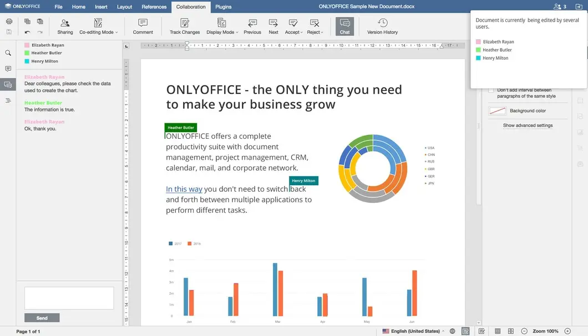

<!--
N.B.: This README was automatically generated by https://github.com/YunoHost/apps/tree/master/tools/README-generator
It shall NOT be edited by hand.
-->

# OnlyOffice for YunoHost

[](https://dash.yunohost.org/appci/app/onlyoffice)    
[](https://install-app.yunohost.org/?app=onlyoffice)

*[Lire ce readme en français.](./README_fr.md)*

> *This package allows you to install OnlyOffice quickly and simply on a YunoHost server.
If you don't have YunoHost, please consult [the guide](https://yunohost.org/#/install) to learn how to install it.*

## Overview

Create and edit documents collaboratively

**Shipped version:** 7.1.0~ynh1

**Demo:** https://www.onlyoffice.com/fr/download-desktop.aspx

## Screenshots




## Disclaimers / important information

## Demo

* A free 30 days demo of Document Server is available from OnlyOffice connector for Nextcloud:
  * Install Nextcloud and the ONLYOFFICE app (connector).
  * Go in the Nextcloud administrator settings, section ONLYOFFICE.
  * Tick the box `Connection to demo ONLYOFFICE Document Server` in Server Parameters.
* Some testing is also possible using [ONLYOFFICE Desktop Editor](https://www.onlyoffice.com/fr/download-desktop.aspx).

## Prerequisite

You should not install OnlyOffice on your main YunoHost domain, especially if you want to use it with a Nextcloud installed on the same domain.
* Add a new domain for OnlyOffice in YunoHost.
  * If your main YunoHost domain was provided by YunoHost, e.g. `domain.nohost.me`, then you don't have to buy/register a new domain name.
  * Just click on `I already have a domain`.
  * Type e.g. `office.domain.nohost.me` and click on `Add`.
* Add a Let's Encrypt certificate for this domain.

## Configuration of OnlyOffice Server

* Assuming that:
  * `yunohost.domain` is your main YunoHost domain.
  * You have configured `office.yunohost.domain` for OnlyOffice, see Prerequisite above.
  * You have Nextcloud installed on `yunohost.domain/nextcloud` or `nextcloud.yunohost.domain`.
* Install `onlyoffice` using CLI or webadmin.
  * Choose a domain name for OnlyOffice that is different from your Nextcloud domain, e.g. `office.yunohost.domain` (or `office.domain.nohost.me`, see previous section).
  * Choose a path for OnlyOffice, e.g. `/` if you install on `office.yunohost.domain` (do not install any other app on this domain).
  * The domain of your Nextcloud instance, e.g. `yunohost.domain/nextcloud` or `nextcloud.yunohost.domain`.
  * Is it a public application? **If you want to connect it to Nextcloud, OnlyOffice should be public**: then select `Yes` or `tick the box`.

## How to edit OnlyOffice documents?

### Web Edition in Nextcloud

Prerequisite: **OnlyOffice should be public**, see previous section.
* In Nextcloud apps store, install `ONLYOFFICE`, i.e. the [ONLYOFFICE connector for Nextcloud](https://apps.nextcloud.com/apps/onlyoffice).
* Go in the Nextcloud `settings` > `Administration` > `ONLYOFFICE` > `Server settings` > `Address of the Document Server`.
* Give the installation domain of your `onlyoffice`, e.g. `https://office.yunohost.domain/` and click `Save`.
* Create a new document and enjoy!

### Desktop Edition on PC

* Download and install a [ONLYOFFICE Desktop Editors](https://www.onlyoffice.com/fr/download-desktop.aspx).
* Start ONLYOFFICE and Go to `Connect to cloud` > `Add cloud`.
  * Select `ONLYOFFICE` and give the installation domain of your `onlyoffice`, e.g. `office.yunohost.domain`
  * or (only if you connected `onlyoffice` to Nextcloud, see previous section).
  * Select `Nextcloud` and give your Nextcloud installation domain, e.g. `yunohost.domain/nextcloud`.
* Create a new document and enjoy!

## Documentation and resources

* Official app website: https://www.onlyoffice.com
* Upstream app code repository: https://github.com/ONLYOFFICE/DocumentServer
* YunoHost documentation for this app: https://yunohost.org/app_onlyoffice
* Report a bug: https://github.com/YunoHost-Apps/onlyoffice_ynh/issues

## Developer info

Please send your pull request to the [testing branch](https://github.com/YunoHost-Apps/onlyoffice_ynh/tree/testing).

To try the testing branch, please proceed like that.
```
sudo yunohost app install https://github.com/YunoHost-Apps/onlyoffice_ynh/tree/testing --debug
or
sudo yunohost app upgrade onlyoffice -u https://github.com/YunoHost-Apps/onlyoffice_ynh/tree/testing --debug
```

**More info regarding app packaging:** https://yunohost.org/packaging_apps