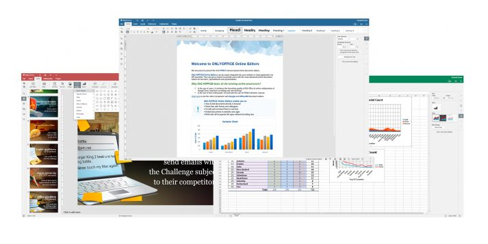
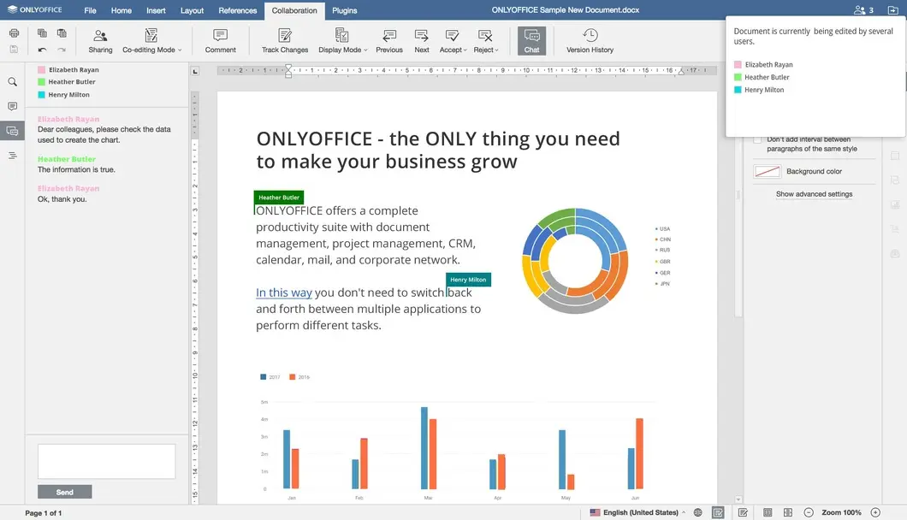

<!--
N.B.: README ini dibuat secara otomatis oleh <https://github.com/YunoHost/apps/tree/master/tools/readme_generator>
Ini TIDAK boleh diedit dengan tangan.
-->

# OnlyOffice untuk YunoHost

[](https://ci-apps.yunohost.org/ci/apps/onlyoffice/)


[](https://install-app.yunohost.org/?app=onlyoffice)

*[Baca README ini dengan bahasa yang lain.](./ALL_README.md)*

> *Paket ini memperbolehkan Anda untuk memasang OnlyOffice secara cepat dan mudah pada server YunoHost.*  
> *Bila Anda tidak mempunyai YunoHost, silakan berkonsultasi dengan [panduan](https://yunohost.org/install) untuk mempelajari bagaimana untuk memasangnya.*

## Ringkasan

ONLYOFFICE Document Server is an online office suite comprising viewers and editors for texts, spreadsheets and presentations, fully compatible with Office Open XML formats: .docx, .xlsx, .pptx and enabling collaborative editing in real time.

Online collaborative edition of ONLYOFFICE documents requires: 
1. a server part, with two installation options:
   1. ONLYOFFICE Document Server packaged for YunoHost. 
   2. The [Community Document Server for Nextcloud](https://apps.nextcloud.com/apps/documentserver_community) 

2. a client part, such as: 
   1. The [ONLYOFFICE connector for Nextcloud](https://apps.nextcloud.com/apps/onlyoffice) 
   2. The [ONLYOFFICE Desktop Editors](https://www.onlyoffice.com/fr/download-desktop.aspx)

A solution made easy by YunoHost is to install (1.i) and (2.i), see [section below](https://github.com/YunoHost-Apps/onlyoffice_ynh/#configuration-of-onlyoffice-server). The Nextcloud addicts may follow [this tutorial](https://github.com/YunoHost-Apps/nextcloud_ynh#configure-onlyoffice-integration) to install (1.ii) and (2.i) on one Nextcloud instance. However, performance and architecture are limited.


**Versi terkirim:** 8.3.1~ynh1

**Demo:** <https://www.onlyoffice.com/fr/download-desktop.aspx>

## Tangkapan Layar




## Dokumentasi dan sumber daya

- Website aplikasi resmi: <https://www.onlyoffice.com>
- Depot kode aplikasi hulu: <https://github.com/ONLYOFFICE/DocumentServer>
- Gudang YunoHost: <https://apps.yunohost.org/app/onlyoffice>
- Laporkan bug: <https://github.com/YunoHost-Apps/onlyoffice_ynh/issues>

## Info developer

Silakan kirim pull request ke [`testing` branch](https://github.com/YunoHost-Apps/onlyoffice_ynh/tree/testing).

Untuk mencoba branch `testing`, silakan dilanjutkan seperti:

```bash
sudo yunohost app install https://github.com/YunoHost-Apps/onlyoffice_ynh/tree/testing --debug
atau
sudo yunohost app upgrade onlyoffice -u https://github.com/YunoHost-Apps/onlyoffice_ynh/tree/testing --debug
```

**Info lebih lanjut mengenai pemaketan aplikasi:** <https://yunohost.org/packaging_apps>
